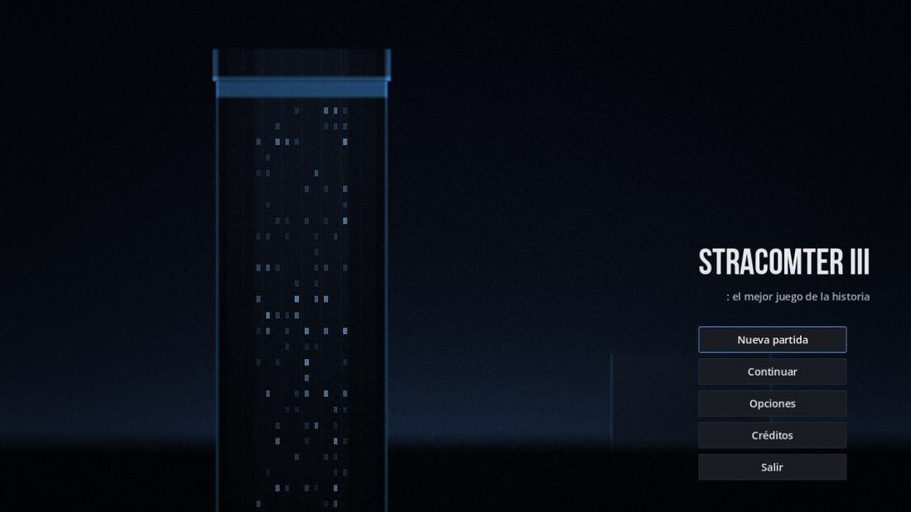
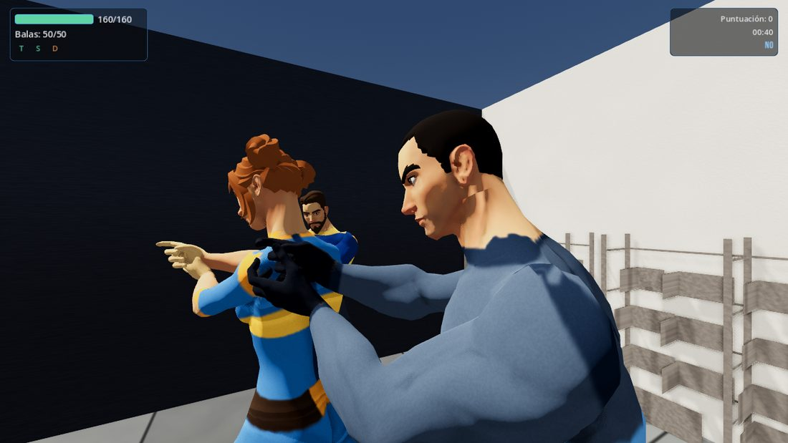
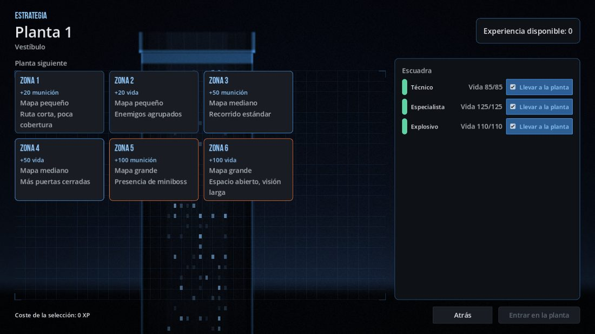
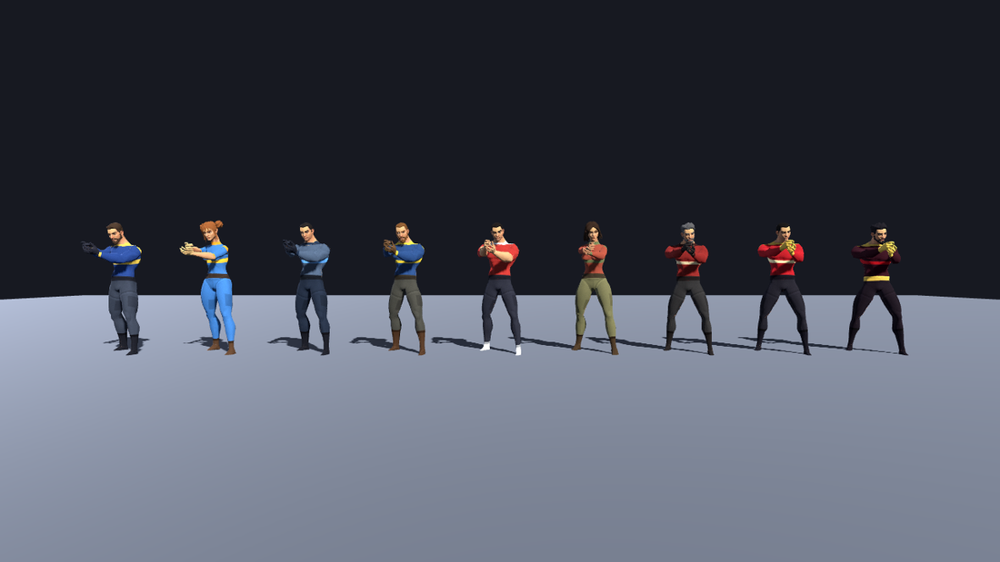

# STRACOMTER III: el mejor juego de la historia

Remake en **Godot 4.7** de *STRACOMTER III: el mejor juego de la historia* —el título
lleva los dos puntos dentro, es parte del chiste—, el shooter táctico que **Chutaos Team** desarrolló en C++ durante el curso
2011-2012 como proyecto ABP de la Universidad de Alicante, y que obtuvo matrícula de
honor.

> Un comando terrorista toma la **Torre Chutaos**, la sede de la empresa fundada por *los
> Chutaos*, un grupo de ingenieros informáticos. Ocho plantas, seis zonas por planta, una
> escuadra y una azotea. Se sube matando.

**Equipo original:** Sergio Gallardo Sales · Alejandro Oñate Latorre ·
Martín Candela Calabuig · Rubén Pardo Millá.
El proyecto de 2012 se liberó bajo licencia BSD.



---

## Estado

En desarrollo activo. El proyecto original vive intacto en `legacy/` y **ya no se
compila**: se ha convertido en especificación. La arqueología completa de aquel código
—con cita `fichero:línea` de cada afirmación— está en `docs/analisis/`.

## Qué hay aquí

```
game/         Proyecto Godot 4.7 (abre esta carpeta en el editor)
docs/         Decisión de motor, GDD, arquitectura, roadmap y evolutivos
docs/analisis/ Arqueología del C++ de 2012: reglas, IA, Simplex, datos y motores
legacy/       El proyecto original de 2011-2012, intacto y de SOLO LECTURA
tools/        Conversor de los 26 mapas originales a escenas de Godot
.claude/agents/ Los 15 agentes especializados que desarrollan el proyecto
```

Empieza por [`docs/01-gdd.md`](docs/01-gdd.md) si te interesa el juego, o por
[`docs/00-decision-tecnologica.md`](docs/00-decision-tecnologica.md) si te interesa por
qué Godot.

## Cómo se ve

| | |
|---|---|
|  |  |
| La planta 1 con la escuadra: la Técnica y el Especialista en formación. | La pantalla de Estrategia, que en 2012 era una ruleta aleatoria y aquí es una elección informada. |



Los nueve arquetipos: cuatro de la escuadra del jugador en azul, cinco de la
Corporación en rojo. Cuerpos CC0 de Quaternius con los uniformes generados por
`tools/character_skins/`. Con `: chutaos on` se cambian por los modelos, el
audio y las texturas de 2012.

Las capturas se generan con `tools/screenshots/capture.sh`, no a mano — ver el
porqué en `CLAUDE.md`.

## Cómo ejecutarlo

Necesitas **Godot 4.7.2** ([descarga](https://godotengine.org/download)). No hace falta
nada más: ni compilador, ni SDK, ni licencia.

```bash
godot --path game                      # abrir el juego
godot --headless --path game res://tests/run_tests.tscn   # pruebas, sin GPU
```

Las pruebas salen con código distinto de cero si algo falla, y es lo que corre CI.

### Descargar el juego ya compilado

No hace falta Godot: cada empujón a una rama publica los ejecutables de **Linux**
y **Windows** como artefactos del trabajo de CI
([Actions](https://github.com/alexol91/StracomterIII/actions) → el último trabajo
→ *Artifacts*). Es un solo fichero, sin instalador.

macOS no está: exportarlo desde Linux falla en una comprobación de configuración
que Godot no nombra, y un binario sin firmar tampoco se abre en un Mac sin
desactivar Gatekeeper.

## Licencia

**MIT** para el remake — `game/`, `tools/`, `docs/`, `.github/` y la raíz.

El proyecto de 2012 **no tenía ninguna licencia**: no hay `LICENSE` ni `COPYING`
en `legacy/trunk/`, y lo único que declara autoría son las cabeceras de los
fuentes («Author: Chutaos Team»). No había, por tanto, licencia que copiar; lo
que se conserva literal es el titular del copyright.

`legacy/` **no está cubierto**: es documento fuente de solo lectura y arrastra
dependencias de terceros con licencias propias, algunas incompatibles (GPC es
no comercial, WankelParticles es GPLv3) y assets de procedencia sin cerrar
(fuentes de Valve, modelos `.3ds`, música sin documentar). Nada de eso se
reutiliza en el remake, pero mientras `legacy/` esté publicado se publica con
él. Los detalles, en `LICENSE` y `docs/analisis/legacy-datos-assets.md`.

## Cómo contribuir

El proyecto lo desarrollan agentes especializados con **propiedad exclusiva de
ficheros** (`docs/03-equipo-agentes.md`): cada uno escribe solo en su carpeta.
Dos agentes tocando el mismo fichero es el fallo más caro de este modelo.

Antes de tocar nada, **lee `CLAUDE.md`**. No es documentación de cortesía: es la
lista de los fallos que este proyecto ya ha pagado, y casi ninguno daba un error
en consola. Los cuatro apartados que más ahorran:

* **El principio de los valores por defecto** — el valor por defecto de un dato
  que no ha llegado nunca puede ser el permisivo.
* **Si el entregable es visual, míralo** — `tools/screenshots/capture.sh`.
* **Lo que solo se ve JUGANDO** — `tools/combat_probe/probe.sh` (¿pelean?) y
  `tools/run_probe/probe.sh` (¿se acaba la torre?). Un subsistema verde no es un
  juego, y una pantalla que se muestra y se tapa en el mismo frame no existe.
* **Lo que solo se ve en el binario exportado** — exporta y ARRANCA el
  ejecutable antes de dar algo por bueno.

Lo que tiene que estar en verde antes de un PR:

```bash
godot --headless --path game res://tests/run_tests.tscn   # 717 pruebas
bash tools/ci/check_clean_boot.sh <godot>                 # ni un aviso
bash tools/combat_probe/probe.sh <godot>                  # ¿pelean los enemigos?
bash tools/run_probe/probe.sh <godot>                     # ¿se acaba la torre?
bash tools/perf_probe/probe.sh <godot>                    # ¿cabe en el frame?
```

Convenciones que CI hace cumplir: GDScript con **tipado estático estricto** (los
avisos son errores), nombres de dominio en inglés en el código y español en la
UI vía claves de traducción, comentarios en español, escenas y recursos siempre
en **texto**, y **ningún número de balanceo en código** — todo en `.tres` bajo
`game/src/data/`.

El trabajo pendiente, con su causa medida y no adivinada, está en
[`docs/04-roadmap.md`](docs/04-roadmap.md).

## Qué se conserva del original y qué no

**Se conserva** el diseño de juego completo: las cuatro clases con sus estadísticas
reales, los tres arquetipos de enemigo y los dos jefes, las 8 plantas × 6 zonas con su
tabla exacta de mapas y recompensas, los compañeros de escuadra, las puertas que alteran
la navegación, el combate con sus fórmulas, **los 26 mapas dibujados a mano en 2012**
(convertidos automáticamente a 3D) y el **Simplex** que decidía la composición enemiga.

**Se rehace** todo lo que en 2012 hubo que escribir a mano porque no había motor: el
motor gráfico sobre OpenGL de pipeline fijo, el wrapper de Box2D, el de sonido, el de
partículas y la biblioteca de widgets propia. Godot los da hechos y mejores, y eso libera
al proyecto para trabajar en lo único que sigue teniendo valor: **el diseño y la IA**.

**Se corrige** lo que la arqueología demostró que estaba roto. Tres ejemplos:

* Las estadísticas estaban **triplicadas y contradictorias** en tres ficheros, y las que
  el juego usaba de verdad no eran las que parecía.
* La programación lineal que elegía los enemigos era **degenerada**: su óptimo entero
  daba ~26 enemigos del mismo tipo, planta tras planta. Se conserva el solucionador
  (con aritmética racional exacta, como el original) y se reformula el problema.
* Los bots veían **a través de las paredes** —comprobaban el cono de visión pero no la
  oclusión— y su cono periférico era código inalcanzable.

## Licencia

Pendiente de fijar; la intención es **BSD**, como el proyecto original. Los assets del
legacy están bajo auditoría: hay material de terceros que no se reutilizará.
